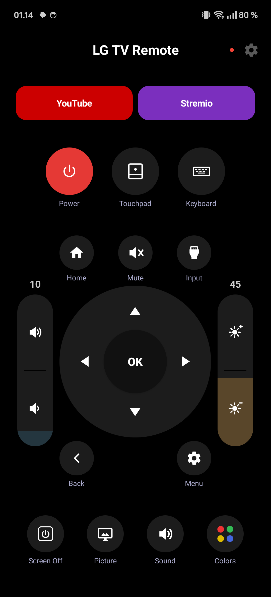
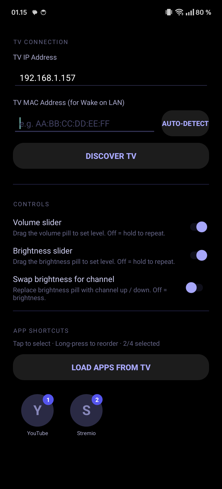

# LG Power

An Android remote control app for LG WebOS TVs, built for a OnePlus 12 with a built-in IR blaster.

 

## Features

- **Power** — IR blast toggle (works even when the TV is off)
- **D-pad & OK** — navigate menus with hold-to-repeat
- **Volume & Mute** — hold-to-repeat on volume buttons
- **Screen Off** — turn off the panel without full standby
- **Touchpad** — full-screen cursor mode with drag-to-move and tap-to-click
- **Keyboard** — type text directly to the TV (great for YouTube search)
- **App shortcuts** — configurable 2–4 shortcuts, selected from all apps on the TV
- **Home screen widgets** — Power, Screen Off, and OK/Enter widgets

## Setup

1. Install the app
2. Make sure your phone and TV are on the same Wi-Fi network
3. Tap the gear icon (top-right) and enter your TV's IP address
4. Press any button — accept the pairing prompt on the TV
5. Done — subsequent commands connect instantly

## Requirements

- Android phone with IR blaster (for the Power button)
- LG WebOS TV (tested on C4)
- Both devices on the same local network
