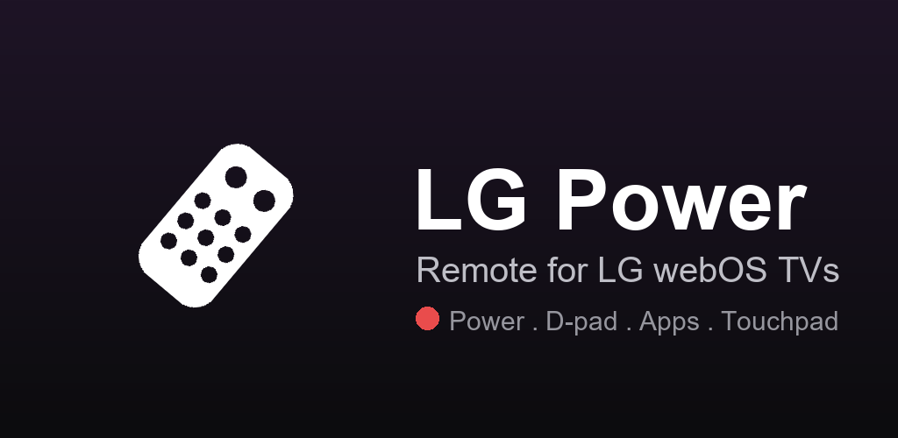
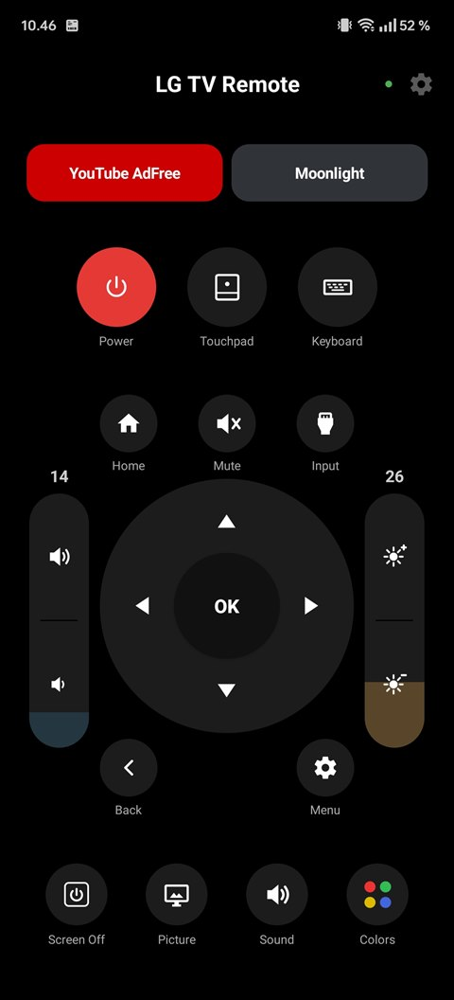
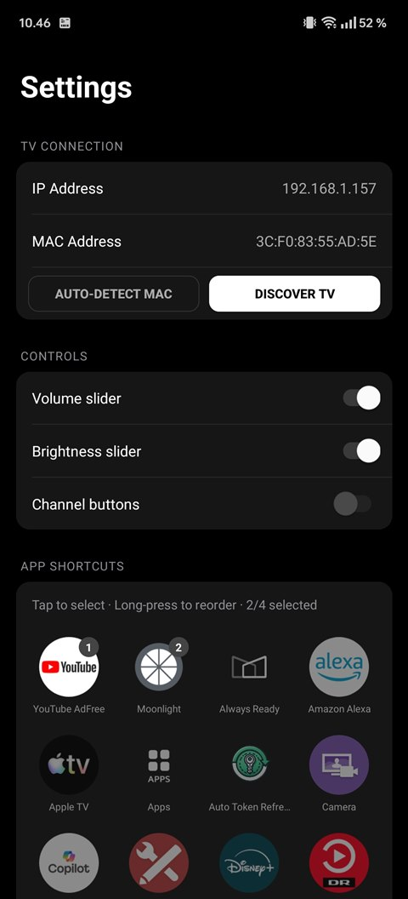
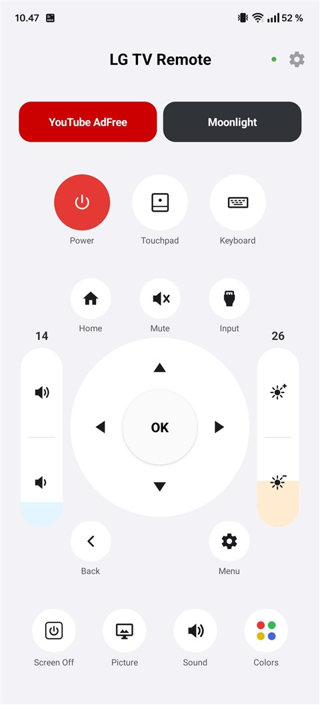
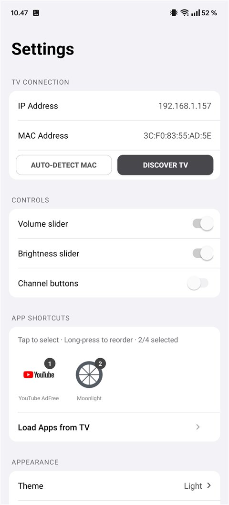

<p align="center">
  
</p>

<p align="center">
  <a href="../../releases/latest"></a>
</p>

LG Power is an Android remote for LG webOS TVs. It talks to the TV over Wi-Fi, wakes it with Wake-on-LAN, and can fall back to the phone's IR blaster when the network path is down.

<p align="center">
  
  
  
  
</p>

## Features

- **Power**: tap toggles the TV over the network (Wake-on-LAN to turn it on), long-press sends the IR power code for when Wi-Fi can't reach it.
- **D-pad, OK, volume and mute**, all with hold-to-repeat, plus optional volume and brightness sliders and channel buttons.
- **Screen Off** turns off the panel without putting the TV in full standby.
- **Touchpad**: full-screen cursor mode with drag-to-move and tap-to-click.
- **Keyboard**: type directly to the TV, handy for search fields.
- **App shortcuts**: two to four configurable buttons, picked from the apps installed on your TV.
- **Home screen widgets** for Power, Screen Off and OK.
- **Themes**: eight built-ins (Dark, Light, Nord, Dracula, Catppuccin, Monokai, One Light, Solarized Light) plus a custom theme editor.

## Download

Grab the latest signed APK from the [Releases](../../releases/latest) page and install it. You may need to allow installing from unknown sources.

## Setup

1. Connect your phone to the same Wi-Fi network as the TV.
2. Open the app. It searches the network and lists the TVs it finds.
3. Tap your TV, then accept the pairing prompt on the TV screen.

Pairing is remembered, so later commands connect instantly. You can also set the TV's IP address by hand in settings (gear icon, top right).

## Requirements

- An LG webOS TV (developed against a C4) and an Android phone on the same network.
- An IR blaster on the phone is optional; it only backs the long-press power fallback.

## Build from source

```bash
./gradlew assembleDebug
```

Requires JDK 17 or newer.

## Disclaimer

LG Power is an independent hobby project. It is not affiliated with, endorsed by, or connected to LG Electronics. LG and webOS are trademarks of LG Electronics Inc.
