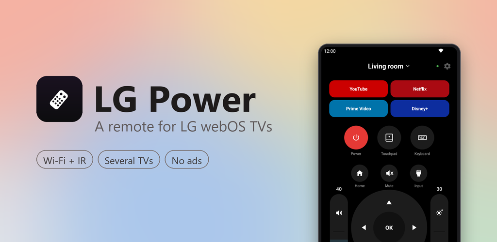
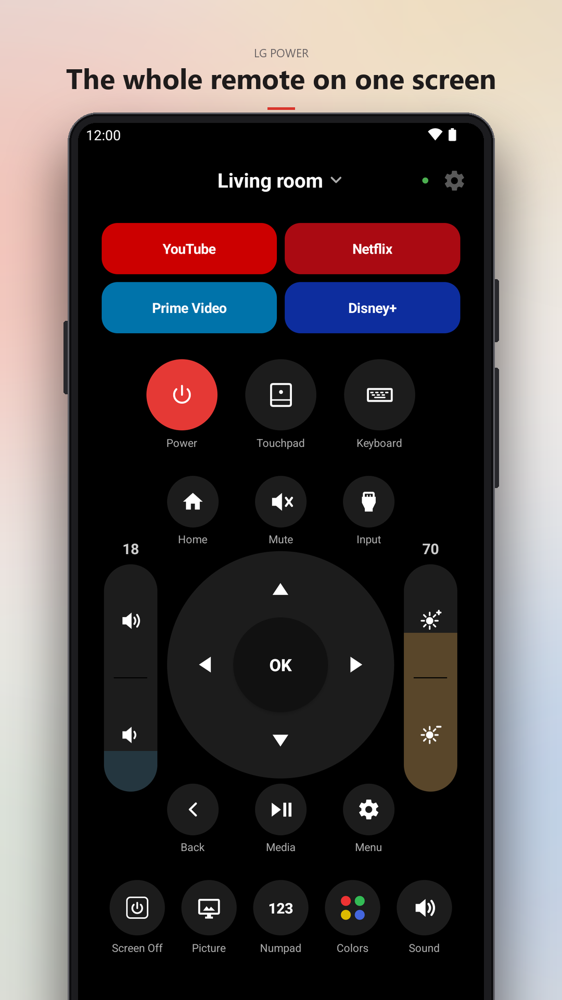
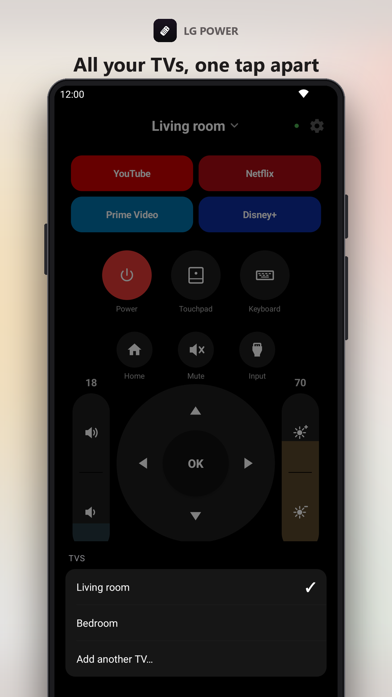
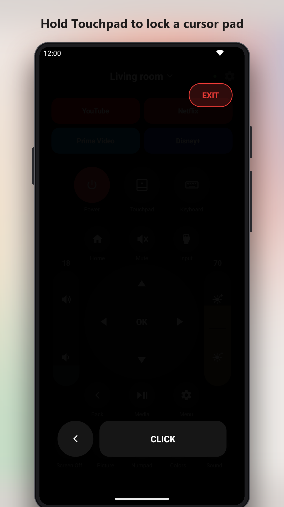
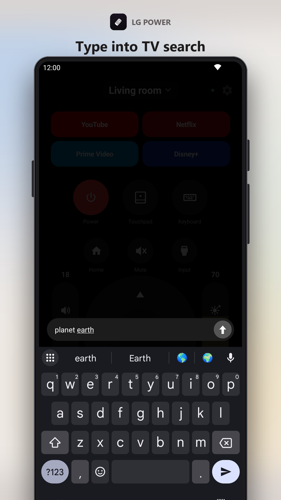
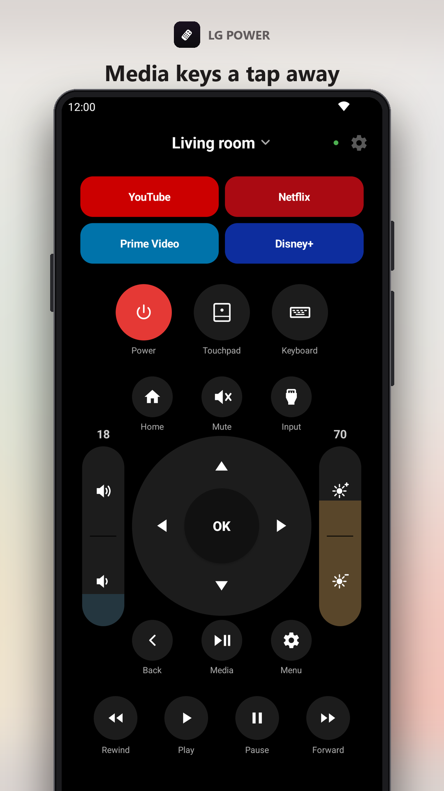
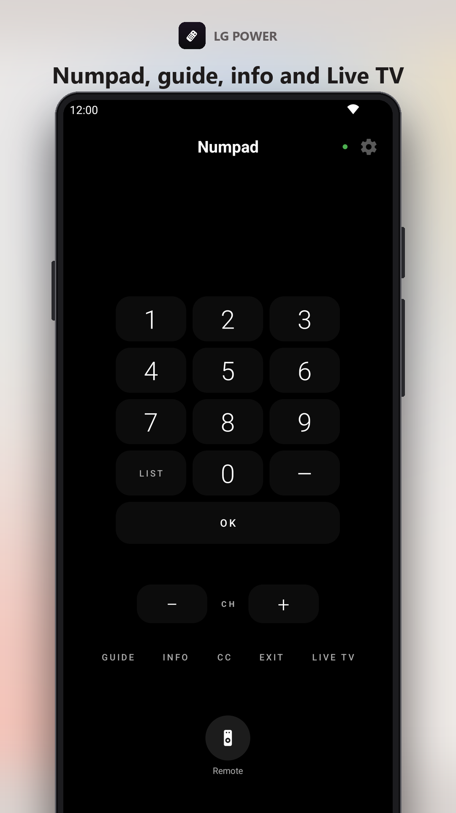
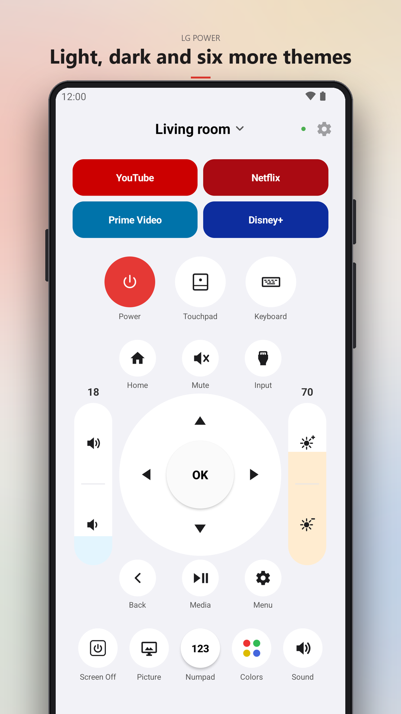
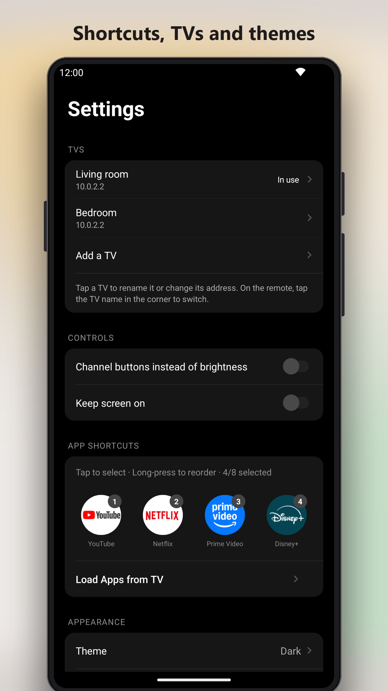

<p align="center">
  
</p>

<p align="center">
  <a href="../../releases/latest"></a>
  <a href="https://play.google.com/store/apps/details?id=com.nic.lgpower"></a>
</p>

LG Power is a free, open source Android remote for LG webOS TVs. It talks to the TV over your local network, wakes it from standby with Wake-on-LAN, and falls back to the phone's IR blaster when the network can't reach it. No ads, no accounts, nothing tracked.

<p align="center">
  
  
  
  
</p>
<p align="center">
  
  
  
  
</p>

<p align="center">
  <a href="https://www.reddit.com/r/LGOLED/comments/1wczbug/">Watch a 40 second tour of the app</a>
</p>

## Features

- **Works on every webOS version**, including the 2025 and 2026 sets (webOS 25 and 26) that quietly broke pairing for most remote apps.
- **Power** over the network: Wake-on-LAN turns the TV on from standby, and the status dot follows the TV's real power state. Long-press sends the IR power code for when Wi-Fi can't reach it.
- **Several TVs**: tap the name at the top to switch between saved TVs or add another. Each TV keeps its own pairing and shortcuts.
- **D-pad, OK, Back, Home, Input, Mute**, with hold-to-repeat on the d-pad. Volume and brightness are sliders you can also tap; the brightness slider can be swapped for channel buttons.
- **App shortcuts**: up to eight, picked from the apps installed on your TV. A new TV starts with the streaming apps it has.
- **Touchpad**: tap and drag straight from the button to move the pointer, or hold it to lock a full-screen cursor pad.
- **Keyboard**: type on the phone, send to the TV. Works in the TV's search and browser.
- **Media keys**: rewind, play, pause and forward behind a Media button; the colour keys behind Colors.
- **Numpad** with channel rocker, OK, LIST, Guide, Info, subtitles, Exit and Live TV.
- **Picture mode, sound mode and input** pickers, and a Screen Off that blanks the panel without putting the TV in standby.
- **Home screen widgets** for Power, Screen Off, OK and any app shortcut.
- **Themes**: Dark, Light, Nord, Dracula, Catppuccin, Monokai, One Light and Solarized Light, plus an editor for your own with a live preview.
- **Service remote** (Settings › Advanced): EZ-Adjust and IN-Start over IR for phones with a blaster. Careful in there.
- **Keep screen on** for a spare phone used as a dedicated remote, with a warning about OLED burn-in.
- A short **guided tour** after setup, replayable from Settings › About.

## Download

Install from [Google Play](https://play.google.com/store/apps/details?id=com.nic.lgpower), or grab the latest signed APK from the [Releases](../../releases/latest) page (you may need to allow installing from unknown sources).

## Setup

1. Put the phone on the same network as the TV. A TV connected to the phone's own hotspot works too.
2. Open the app. It searches the network and lists the TVs it finds.
3. Tap your TV, accept the pairing prompt on the TV screen, and give the TV a name.

Pairing is remembered, so later commands connect instantly. If the TV sits on another VLAN, or is wired through a dongle that discovery can't see, use **Enter IP address manually** on the setup screen. Across VLANs the phone needs to reach the TV on TCP port 3001, and Wake-on-LAN only crosses the boundary if your router forwards it.

For Wake-on-LAN the TV needs **Turn on via Wi-Fi** enabled (Settings › General › Devices › External Devices › TV On With Mobile; on 2025 and newer sets Support › IP control settings › Wake on LAN). If waking only works for a few minutes after switching the TV off, also enable Quick Start+ (Always Ready on 2022+ models) so the network stays awake in standby.

## Requirements

- An LG webOS TV (developed against a C4, confirmed by users on C3, C4, C6, G5 and older LCD sets) and an Android phone on the same network.
- An IR blaster on the phone is optional; it only backs the power fallback and the service remote.

## Build from source

```bash
./gradlew assembleDebug
```

Requires JDK 17 or newer. `tools/faketv` is a fake webOS TV for developing against an emulator without a real set.

## Disclaimer

LG Power is an independent hobby project. It is not affiliated with, endorsed by, or connected to LG Electronics. LG and webOS are trademarks of LG Electronics Inc.
